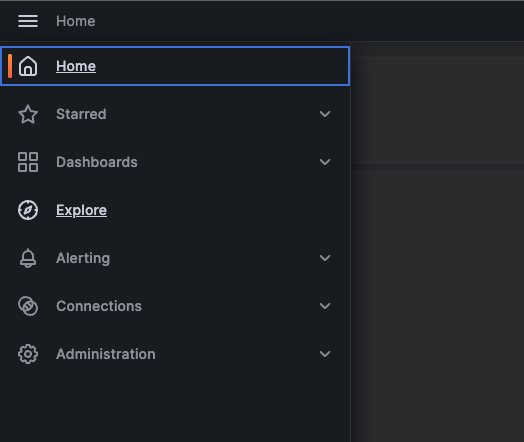
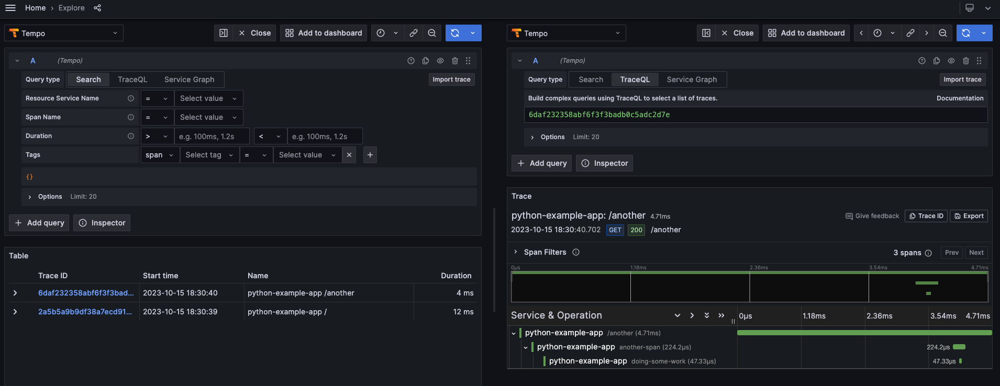

# OpenTelemetry Demo

## Prerequisites
- Docker
- Docker Compose
- Python3

## Components
- Grafana Tempo: Distributed tracing backend
- Prometheus: Metrics backend
- Grafana: Visualization frontend

## How to run?
1. Run `docker compose up --build -d` to start the services (Python Example App, Grafana Tempo, Prometheus, Grafana)
1. curl http://localhost:8080/ and http://localhost:8080/another to generate some traces
1. Open Grafana at http://localhost:3000/
1. Open the Explore page and select Tempo as the data source
    
1. Click the Run query button to see the traces
    